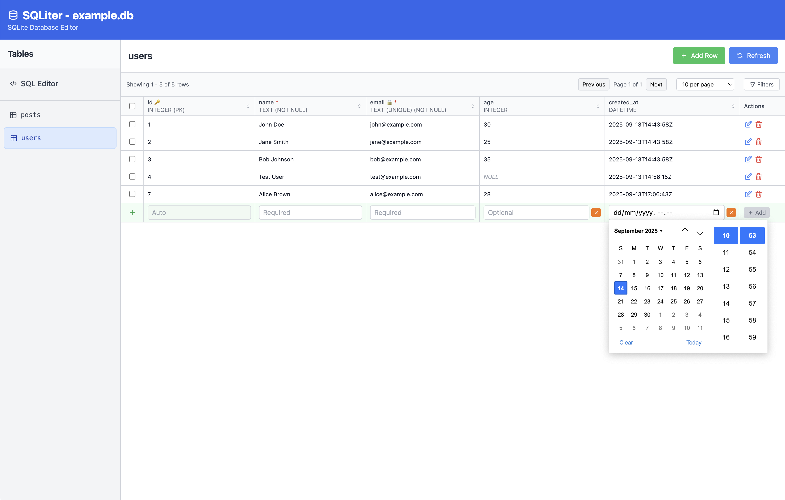

# SQLiter

A web-based SQLite database editor with a Go backend and React frontend, packaged as a single executable.



## Features

- Web-based interface for browsing SQLite databases
- Table listing in a sidebar
- Full CRUD operations (Create, Read, Update, Delete)
- Responsive UI built with React and Tailwind CSS
- Single executable with embedded frontend assets

## Quick Start

### Using Docker

```bash
# Build the Docker image
docker build -t sqliter .

# Run with your database
docker run -p 1234:8080 -v /path/to/your/database.db:/data/database.db sqliter --port 8080 --db /data/database.db
```

### Building from source

```bash
# Build everything
./build.sh

# Run with your database
./sqliter --port 1234 --db example.db
```

### Manual build steps

1. Build the frontend:
```bash
cd web
npm install
npm run build
cd ..
```

2. Build the Go application:
```bash
go build -o sqliter ./cmd/main.go
```

3. Run the application:
```bash
./sqliter --port 1234 --db your-database.db
```

## Usage

Once running, open your browser to `http://localhost:1234` (or whatever port you specified).

The interface provides:
- **Left sidebar**: List of all tables in the database
- **Main area**: Table contents with pagination
- **CRUD operations**: Add, edit, and delete rows through the UI

## API Endpoints

The application exposes a REST API:

- `GET /api/tables` - List all tables
- `GET /api/tables/{table}/schema` - Get table schema
- `GET /api/tables/{table}/data?limit=100&offset=0` - Get table data
- `POST /api/tables/{table}/rows` - Insert a new row
- `PUT /api/tables/{table}/rows` - Update a row
- `DELETE /api/tables/{table}/rows` - Delete a row

## Development

For development, you can run the frontend and backend separately:

```bash
# Terminal 1: Start the Go backend
go run ./cmd/main.go --port 8080 --db your-database.db

# Terminal 2: Start the React dev server
cd web
npm run dev
```

The React dev server will proxy API calls to the Go backend.

## Testing

Run the API tests:

```bash
go test ./internal/api -v
```

## Technology Stack

- **Backend**: Go with Gin framework, SQLite3 driver
- **Frontend**: React 18, TypeScript, Tailwind CSS, Vite
- **Build**: Docker multi-stage build